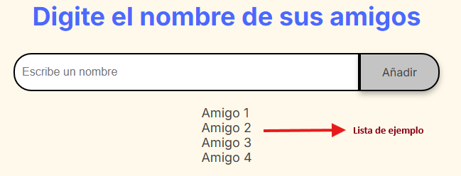
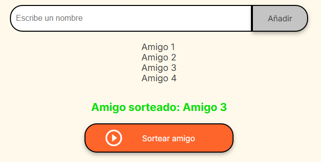

# Desafío de Amigo Secreto

El desafío consiste en crear una aplicación que tiene como finalidad elegir un amigo aleatorio a partir de una lista proporcionada por el usuario.

## Funcionalidades del Proyecto

1. **Crear una lista de amigos**  
   El usuario puede agregar amigos a la lista escribiendo sus nombres.
   

2. **El programa elige aleatoriamente un amigo de la lista**  
   El sistema selecciona un amigo aleatoriamente y lo muestra al usuario.
   

## Tecnologías Utilizadas

- **JavaScript**  
  Para la lógica de la aplicación y la interacción con el DOM.

- **HTML**  
  Para la estructura básica de la página.

- **CSS**  
  Para el diseño visual y la disposición de los elementos en la interfaz.

## Desarrollador de la Solución

**Fernando Martinez Chehda**  
Creador de la solución al desafío.